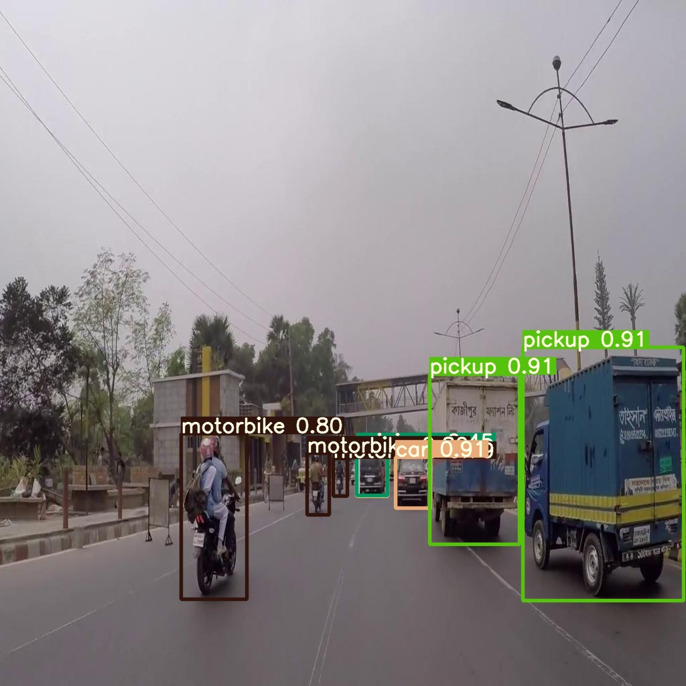
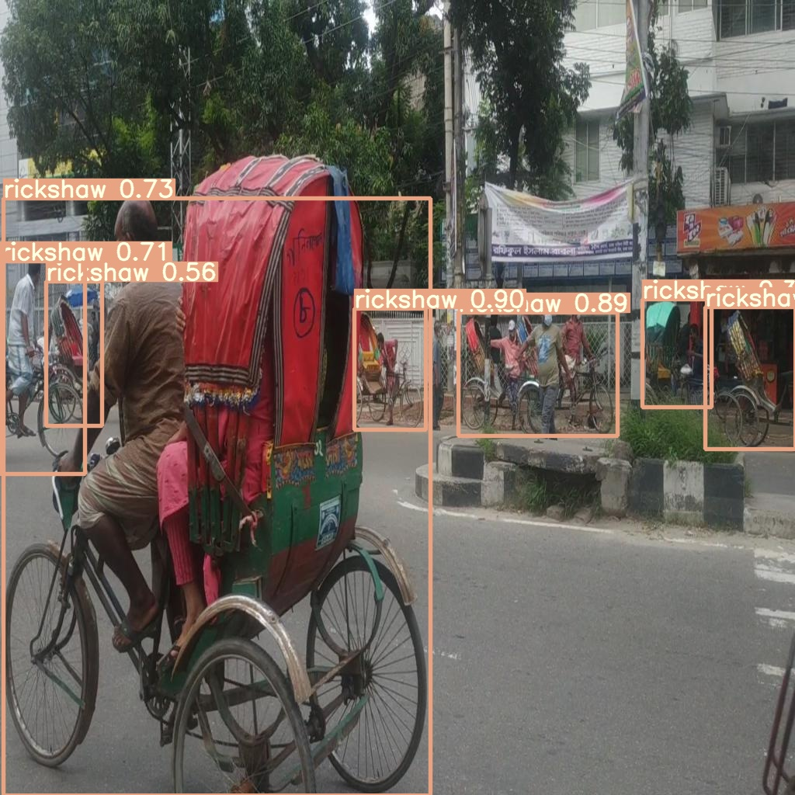
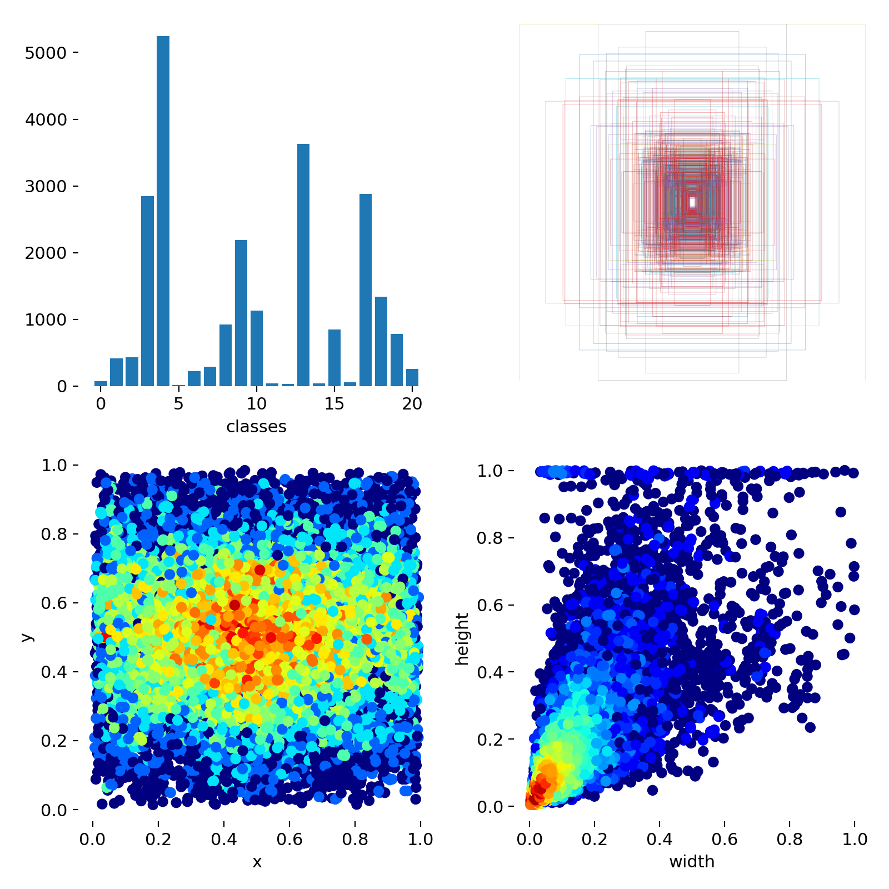
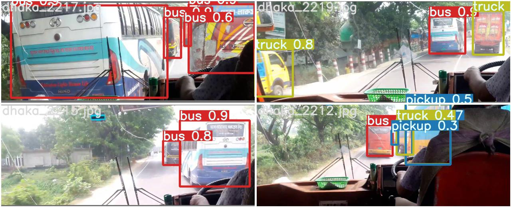
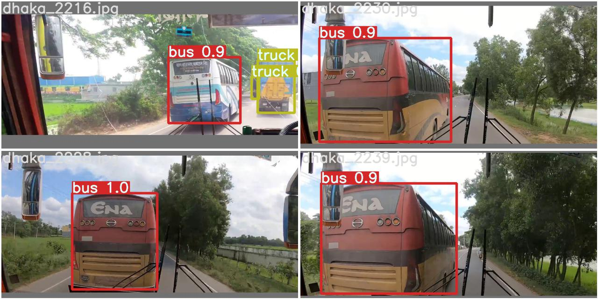
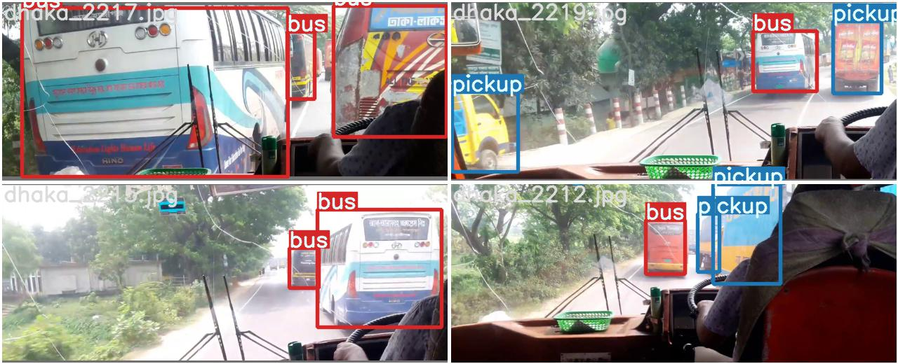
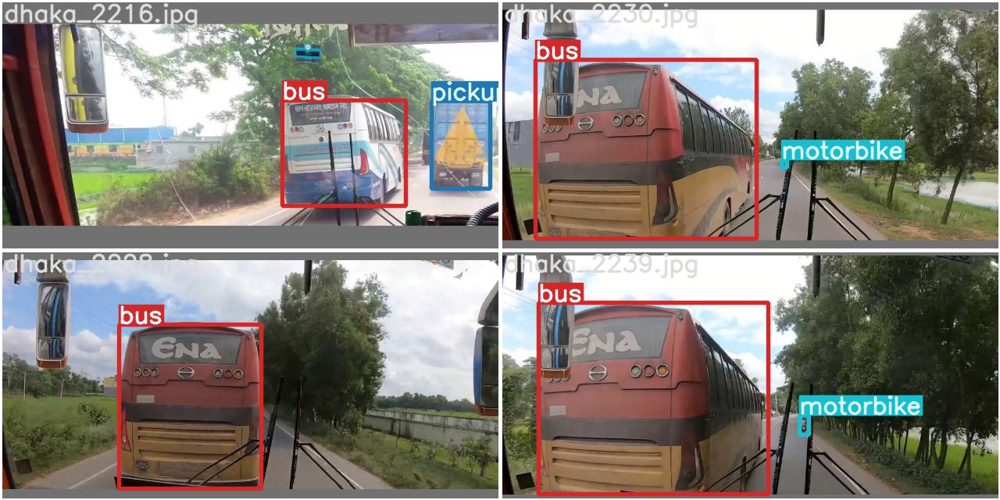
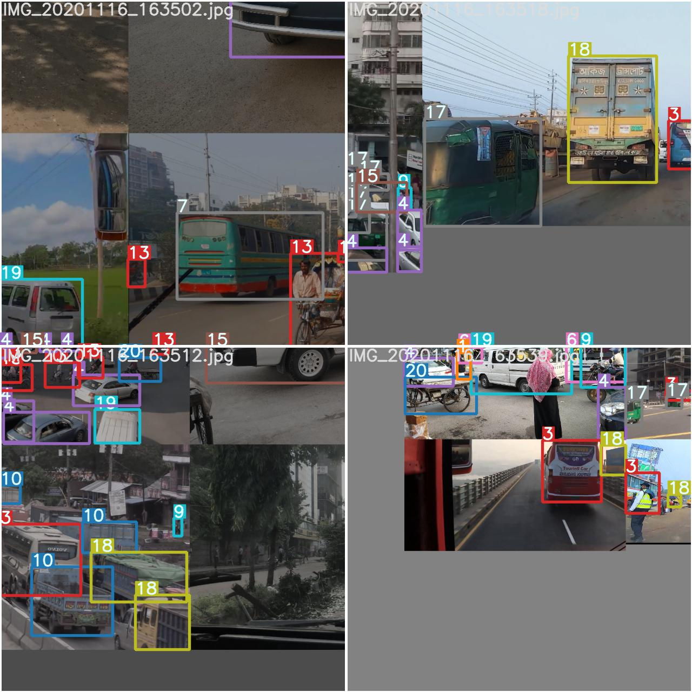
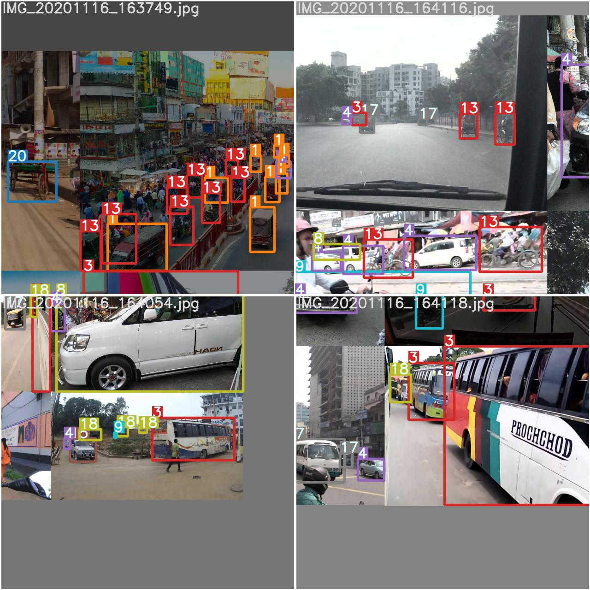

# Dhaka AI

My solution of [Dhaka Ai Traffic Detection Challenge]((https://dhaka-ai.com/).

> An international AI-based Dhaka Traffic Detection Challenge funded by Elsevier would be co-organized during STI 2020

`test_batch0_pred.jpg` shows test batch 0 predictions:

`test_batch0_labels.jpg` shows test batch 0 labels:

`train_batch0.jpg` shows train batch 0 mosaics and labels:

Best Result: 0.1346 (MBSTU_Underrated)

