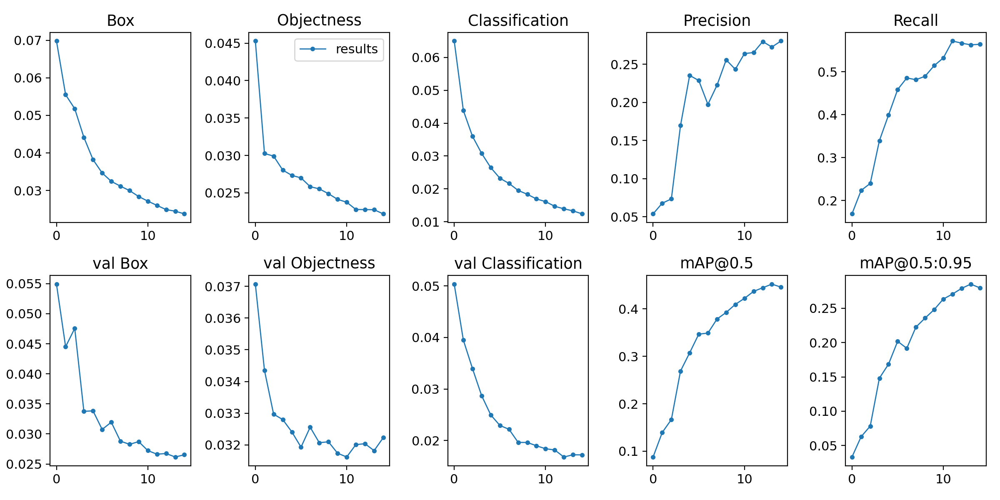

# Dhaka AI

My solution of [Dhaka Ai Traffic Detection Challenge](https://dhaka-ai.com/).

> An international AI-based Dhaka Traffic Detection Challenge funded by Elsevier would be co-organized during STI 2020

### Inference on Test Image
 

### Train Data Overview

### Train Result

### `test_batch[0-9]+_pred.jpg` shows validation batch predictions:
 

### `test_batch[0-9]+_labels.jpg` shows validation batch labels:
 

### `train_batch[0-9]+.jpg` shows train batch mosaics and labels:
 

### Best Result
MBSTU_Underrated: 0.1346

